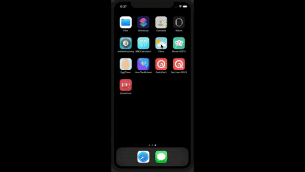

#  Cli-mate

<h3 align="center">

</h3>
## Used Open Weather API

## What is Cli-mate

It's a beautiful, dark-mode enabled weather app. You'll be able to check the weather for the current location based on the GPS data from the iPhone as well as by searching for a city manually. 

## Features

* a dark-mode enabled app.
* used vector images as image assets.
* Learn to use URLSession to network and make HTTP requests.
* Parsed JSON with the native Encodable and Decodable protocols. 
